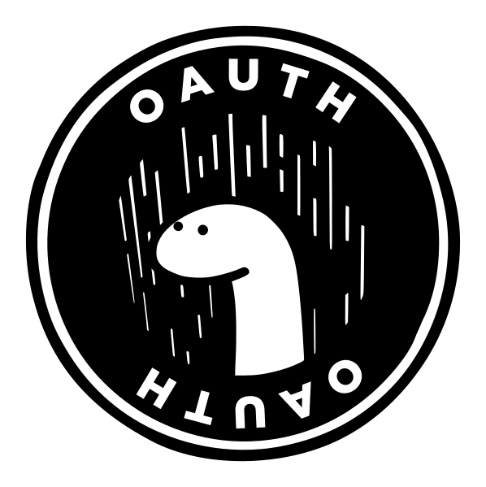

<div align="center">
    
    <h1>OAuth 2.0 for Deno</h1>
    <p>
        <b>Setup the OAuth 2.0 flow for apps easily.</b>
    </p>
    <p>
        
        
        
        
        
    </p>
    <p>
        <b><a href="https://deno.land/x/oauth2_deno">View on deno.land</a></b>
    </p>
    <br>
    <br>
    <br>
</div>

## Simple usage
```ts
import { Router } from 'https://deno.land/x/oak@v6.5.0/mod.ts';
import { AuthorizationCodeGrant } from 'https://raw.githubusercontent.com/DiFronzo/oauth2-deno/main/mod.ts';

const router = new Router();

const client = new AuthorizationCodeGrant({
  authorizationEndpointURI: "https://webexapis.com/v1/authorize", // example
  tokenEndpointURI: "https://webexapis.com/v1/access_token", // example
  clientId: 'MY-CLIENT-ID',
  clientSecret: 'MY-CLIENT-SECRET',
  redirectURI: 'MY-CALLBACK-URL',
  scope: 'MY-SCOPE'
});

router.get("/auth/webex", (context) => {
  context.response.redirect(client.constructAuthorizationRequestURI({
    parameters: {
      state: "123",
    }
  }));
});

router.get("/api/callback", async (context) => {
    const query = new URLSearchParams(context.request.url.search);
    const code = query.get("code");
    const state = query.get("state"); //You should check state
    let responseApi: any
    if (code) {
        responseApi = await client.requestToken({
            code: code,
        })
    }
    if (responseApi) {
        console.log("Token, etc: ",responseApi)
    }
    context.response.redirect("/");
});
```

## OAuth 2.0 with PKCE
```ts
import { Router } from 'https://deno.land/x/oak@v6.5.0/mod.ts';
import { AuthorizationCodeGrant } from 'https://raw.githubusercontent.com/DiFronzo/oauth2-deno/main/mod.ts';
import { create } from "https://deno.land/x/pkce_deno@v2.0/mod.ts"; // If you need PKCE

const router = new Router();

const client = new AuthorizationCodeGrant({
  authorizationEndpointURI: "https://webexapis.com/v1/authorize", // example
  tokenEndpointURI: "https://webexapis.com/v1/access_token", // example
  clientId: 'MY-CLIENT-ID',
  clientSecret: 'MY-CLIENT-SECRET',
  redirectURI: 'MY-CALLBACK-URL',
  scope: 'MY-SCOPE'
});

const codePair = create();

router.get("/auth/webex", (context) => {
  context.response.redirect(client.constructAuthorizationRequestURI({
    parameters: {
      state: "123",
      code_challenge_method: 'S256',
      code_challenge: codePair.codeChallenge,
    }
  }));
});

router.get("/api/callback", async (context) => {
    const query = new URLSearchParams(context.request.url.search);
    const code = query.get("code");
    const state = query.get("state"); //You should check state
    let responseApi: any
    if (code) {
        responseApi = await client.requestToken({
            code: code,
            parameters: {
                code_verifier: codePair2.codeVerifier,
                refresh_token: ''
            }
        })
    }
    if (responseApi) {
        console.log("Token, etc: ",responseApi)
    }
    context.response.redirect("/");
});
```
